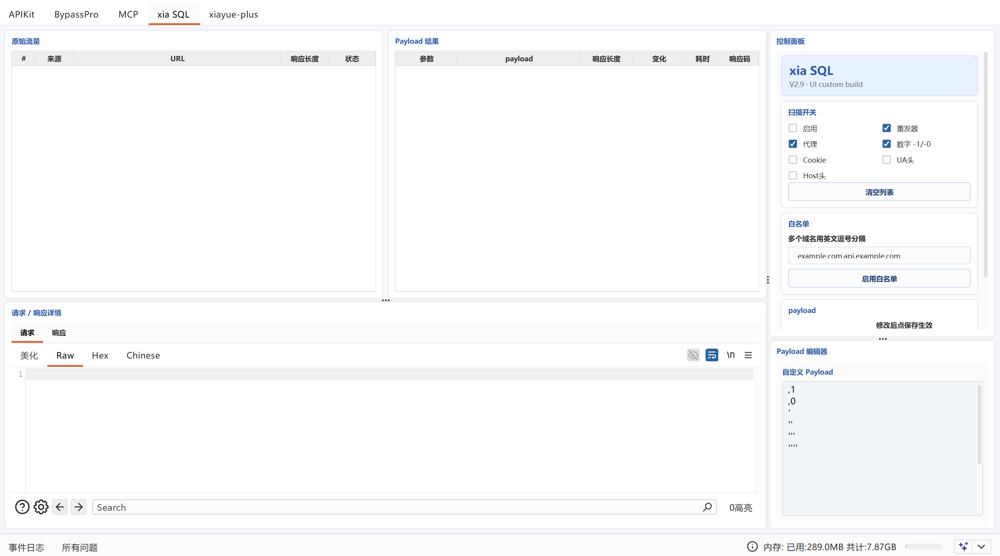

# xiasql-ui

`xiasql-ui` 是基于 [smxiazi/xia_sql](https://github.com/smxiazi/xia_sql) 进行二次开发的 Burp Suite 插件版本，主要用于授权测试场景中的 SQL 注入辅助排查。

本项目保留了上游 `xia_sql` 的核心检测思路，并在此基础上对 UI 布局、默认启动状态、构建流程和可选扫描项进行了整理，方便后续维护与继续修改。

## 界面预览

下图展示了 `xiasql-ui` 当前版本在 Burp Suite 中的主要界面，包括原始流量列表、Payload 结果区、请求/响应详情面板，以及右侧控制面板与 Payload 编辑区。



## 项目来源

- 上游项目：`xia_sql / xia SQL`
- 原始仓库：<https://github.com/smxiazi/xia_sql>
- 原作者：smxiazi / 算命縖子

`xiasql-ui` 不是上游官方版本，而是基于公开源码制作的 UI 优化与功能整理版本。原始代码及相关权利归原作者所有。

## 主要特性

- 支持监听 `Repeater` / `Proxy` 流量。
- 支持右键发送请求到插件扫描。
- 支持 `GET`、`POST`、`Cookie` 参数测试。
- 支持 `JSON` 请求体场景。
- 支持数字参数追加 `-1` / `-0` 测试。
- 支持自定义 Payload。
- 支持自定义 Payload 空格 URL 编码。
- 支持自定义 Payload 参数值置空。
- 支持域名白名单。
- 支持选择是否测试 `User-Agent` 请求头。
- 支持选择是否测试 `Host` 请求头。
- 支持结果表格与 `Request / Response` 联动查看。

## UI 调整

- 重构 Burp 插件面板布局，拆分原始流量、Payload 结果、请求响应详情和控制区。
- 优化右侧控制面板，使用更紧凑的圆角卡片布局，减少控件堆叠和文字遮挡。
- 优化按钮、输入框、表格字体、行高、列宽和选中状态。
- 插件默认启动状态为关闭，避免 Burp 启动后立即开始监听流量。

## 使用方式

1. 打开 Burp Suite。
2. 进入 `Extensions` / `Extender` 页面。
3. 添加 Java 类型插件。
4. 选择项目目录下的 `xia-sql-ui.jar`。
5. 加载后进入 `xia SQL` 标签页。
6. 手动勾选“启用”后，再选择需要监听或测试的项目开始扫描。

默认情况下插件处于关闭状态，不会在 Burp 启动后自动处理流量。

## 构建方式

项目已包含编译依赖：

```text
lib/burp-extender-api-2.3.jar
```

在 Windows PowerShell 中执行：

```powershell
powershell -ExecutionPolicy Bypass -File .\build.ps1
```

构建产物：

```text
xia-sql-ui.jar
dist/xia-sql-ui.jar
```

本项目使用 Java 8 目标版本编译：

```text
javac --release 8
```

在较新的 JDK 上构建时，可能会看到 Java 8 target 已过时的编译警告；只要编译成功即可正常生成 jar。

## Release 建议

建议在 GitHub Releases 中发布预编译 jar，便于直接下载使用。

推荐版本信息：

```text
Tag: v1.1.0
Title: xiasql-ui v1.1.0
Asset: xia-sql-ui.jar
```

Release 描述可参考项目中的 `RELEASE_NOTES.md`。

## 更新日志

### v1.1.0

- 新增 `UA头` 和 `Host头` 开关，可选择是否测试 `User-Agent` / `Host` 请求头。
- 请求头扫描接入原有 Payload 扫描流程，与普通参数使用一致的响应长度、耗时和结果记录逻辑。
- 更新 Release Notes，补充请求头测试能力说明。

### v1.0.0

- 完成 `xiasql-ui` 的初始整理版本。
- 重构 Swing UI，优化控制面板与结果区布局。
- 新增圆角卡片风格面板、按钮和输入框样式。
- 插件默认改为关闭启动。
- 增加本地构建脚本 `build.ps1`。
- 提供可直接加载的 `xia-sql-ui.jar`。

## 目录说明

```text
.
├── BurpExtender.java              # 插件源码
├── README.md                      # 项目说明
├── RELEASE_NOTES.md               # Release 说明
├── build.ps1                      # 本地构建脚本
├── xia-sql-ui.jar                 # 可直接加载的插件 jar
├── dist/
│   └── xia-sql-ui.jar             # 构建输出备份
└── lib/
    └── burp-extender-api-2.3.jar  # Burp Extender API 编译依赖
```

## 安全声明

本项目仅用于合法授权的安全测试、内部验证和学习研究。请勿在未授权目标上使用本插件。使用者应自行确认测试范围、授权边界和当地法律法规要求。

插件输出结果仅作为辅助判断依据，不代表漏洞确认结论。实际漏洞确认仍需结合业务场景、请求响应差异、数据库行为和人工复核。

## 许可证与版权说明

上游仓库在本项目二次开发时未见明确的开源许可证文件，因此本项目不对原始代码重新声明额外开源授权。

- 原始代码及相关权利归原作者所有。
- `xiasql-ui` 的修改部分仅作为基于上游公开源码的二次开发版本提供。
- 如需商业分发、再授权或大规模传播，建议先联系原作者确认授权。

## 致谢

感谢 `xia_sql` 原作者及原项目贡献者提供的基础实现。

上游项目：<https://github.com/smxiazi/xia_sql>
